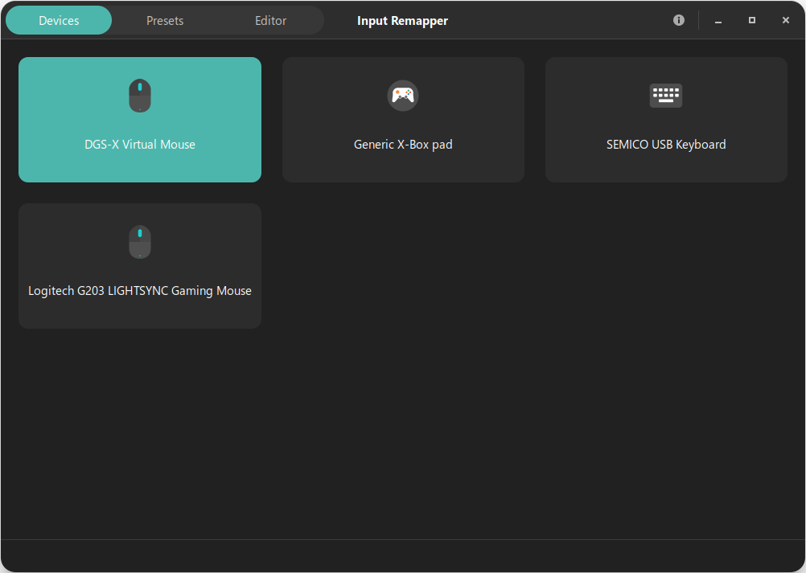
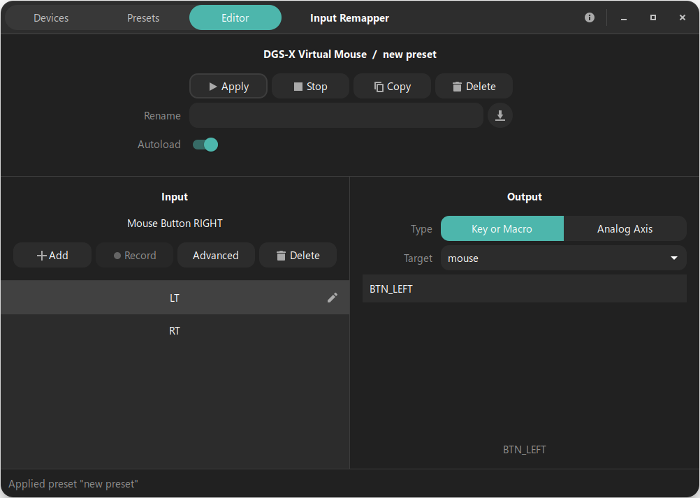
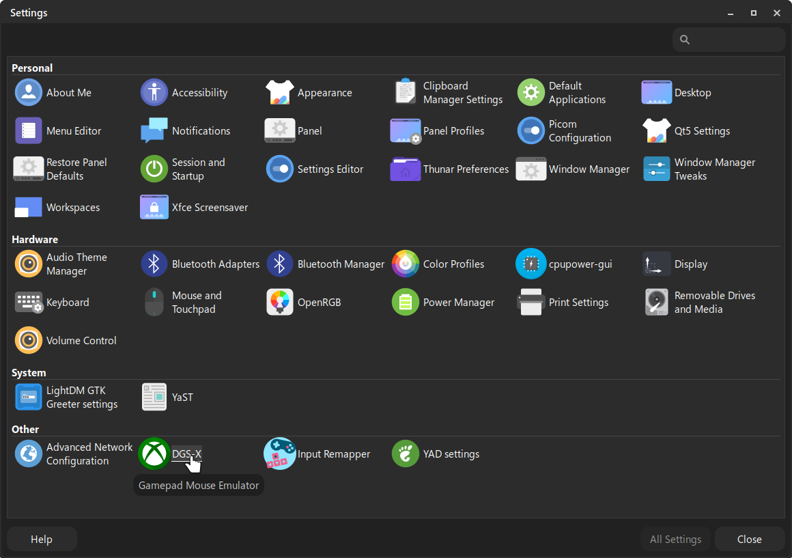

# DGS-X (Desktop Gamepad System - XInput)
**Version 1.0 - Basic Release**

DGS-X is a lightweight Linux utility designed to transform your XInput controller (specifically tested by myself on PDP Series S/X and original Xbox One S/X models) into a fully functional desktop navigation tool. It eliminates the need for a mouse by mapping common desktop actions directly to your gamepad. It is the ideal solution for anyone who wants to navigate the web with a comfortable Xbox controller—or compatible ones—straight from a comfy couch, right towards their favorite Linux Multimedia System.

---

## 🎮 Default Key Mapping (v1.0)

| Controller Input | Desktop Action |
| :--- | :--- |
| **Right Stick** | Mouse Movement (High Precision + Acceleration) |
| **Left Stick (Vertical)** | Mouse Wheel Scroll (Smooth, 25% Speed Reduction) |
| **Right Trigger (RT)** | Mouse Left Click (Selection / Drag & Drop) |
| **Left Trigger (LT)** | Mouse Right Click (Context Menu) |
| **Right Stick Click (R3)** | Mouse Middle Click (M3 / Wheel Click) |
| **Left Bumper (LB)** | Navigation Back (File Manager / Browser) |
| **Right Bumper (RB)** | Navigation Forward (File Manager / Browser) |

## 💡 Natural Feel Combos:

1. Precision Selection: Hold down the Right Trigger and slowly move the Right Analog Stick to make precise text or file selections.
2. Fast Actions: Double-tap the Right Trigger for standard double-click operations.
3. Window Management: Press and hold the Right Trigger on a window title bar, then move the Right Analog Stick to move the window across your workspace.

## 🛠️ Advanced Customization (Input Remapper Support!)

DGS-X is designed to be modular. Instead of forcing a static mapping, it exports a standard virtual device named **"DGS-X Virtual Mouse"**.

This allows for seamless integration with **Input Remapper**:
* **Native Recognition:** DGS-X appears as a dedicated device in the Input Remapper dashboard.
* **On-the-fly Remapping:** You can invert axes, create macros, or swap buttons (like LT/RT) without touching the DGS-X source code.
* **Profile Management:** Save different mapping presets for different use cases (e.g., Browsing vs. Media Center).

> **Tip:** If you already have Input Remapper installed, DGS-X will respect your active presets "out of the box," maintaining full priority and the hardware Safety Lock as well.
> **Unresponsive Stick?** If your specific controller model uses non-standard Axis IDs (e.g., some legacy or 3rd-party gamepads), simply use Input Remapper to bridge your physical sticks to the DGS-X Virtual Mouse. This ensures 100% compatibility regardless of your hardware's internal mapping.

---

## 🔒 Safety Lock (Lock In / Lock Out)

To prevent accidental inputs during gaming sessions or when away from the desk, DGS-X features a hardware-level safety toggle:

* **Hold START for 3 seconds:** Disables all mouse emulations (**LOCKED**).
* **Hold START for 3 seconds again:** Re-activates the service (**ENABLED**).

*A desktop notification via `notify-send` will confirm the status change (Xfce, GNOME and KDE tested).*

---

## 🛠️ Intelligent Auto-Disable

DGS-X is designed to coexist with Steam and other launchers. It automatically detects **Fullscreen** or **Borderless Fullscreen** applications and stays dormant to avoid conflicts with games or Steam Big Picture mode.

---

### Tested Hardware & IDs

The following devices have been manually tested and verified for full compatibility:

* **PDP Wired Controller for Xbox Series X/S** (ID `0e6f:02f3`) - *Developer's Choice*
* **Microsoft Xbox Series S/X / One Controller** (ID `045e:02ea`) - *Standard Reference*
* **Generic XInput Compatible Gamepads** (Generic Microsoft/Xbox drivers)

> **Note on PDP Controllers:** While wired, these units offer superior durability feedback and were the main focus development target for DGS-X. However, you can use the original gamepad as well and the right stick sensitiveness basics may logically differ.

## 🚀 Roadmap

- **v1.5/2.0:** Implementation of a **Graphical User Interface (GUI)**.
- **Custom Mapping:** A visual setup section to rebind keys without touching the code.
- **Sensitivity Profiles:** Adjust movement speed and curves for the analog sticks via a dedicated slider.

## Screenshots & Integration

DGS-X integrates seamlessly across different Linux desktop environments, appearing as a native system service.

### 🎮 Device Detection & Mapping

| Virtual Device Detection | Preset Editor & Mapping |
| :---: | :---: |
|  |  |
| *DGS-X Virtual Mouse detected* | *Mapping logic for LT/RT and triggers* |

### 🖥️ Desktop Environment Integration

| XFCE Settings | GNOME Notifications | KDE Plasma Dash |
| :---: | :---: | :---: |
|  |  |  |
| *XFCE System Category* | *Status Notifications* | *Application Dashboard* |

---
**Author:** Carlo Sitaro  
**License:** GNU GPLv3
